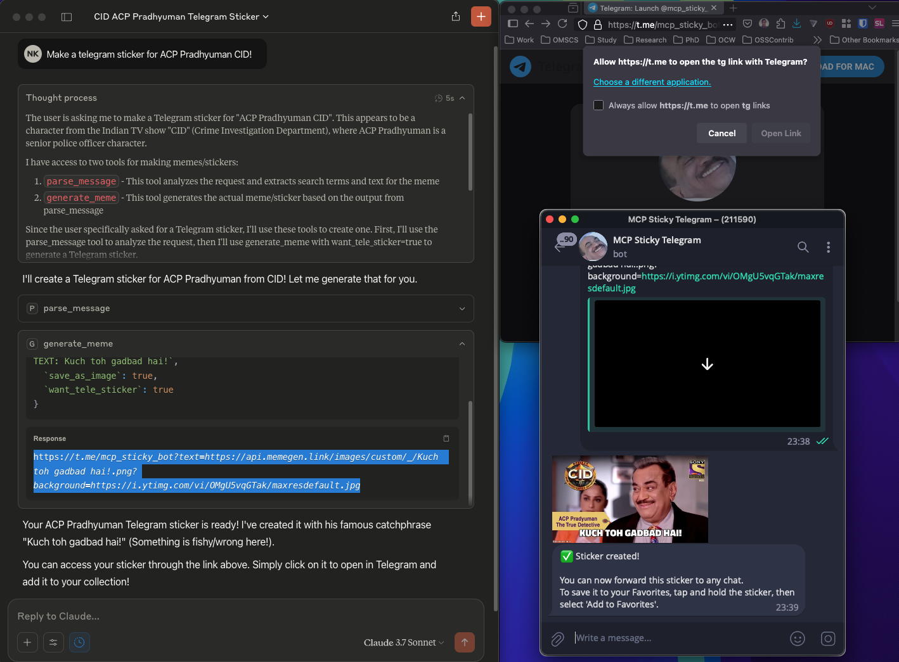
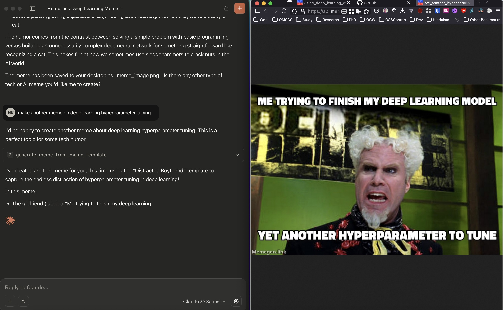

<p></p>

# mcp-meme-sticky
[](https://smithery.ai/server/@nkapila6/mcp-meme-sticky)

Create AI generated memes using MCP Meme Sticky. Can converted generated memes into stickers for Telegram or WhatsApp (WA coming soon). ✨ no APIs required ✨. 

For Telegram, the MCP server produces a link that can produce the image as a sticker. Can be viewed here: <a href="https://github.com/nkapila6/mcp-sticky-tele">MCP-Sticky Telegram Bot</a>.

## Attribution
The MCP server uses several services. Thank you to the following services / libraries.
- [Memegen](https://memegen.link/): GOATED open source meme generator!
- [PythonAnywhere](https://www.pythonanywhere.com/): For their free Python clouds service! It powers the [Telegram bot](https://github.com/nkapila6/mcp-sticky-tele).
- [icrawler](https://github.com/hellock/icrawler): My image crawler is heavily inspired by their library.
- [FastMCP](https://gofastmcp.com/getting-started/welcome): FastMCP makes it easier to make Python MCP servers!

## Completed work
- Meme generation
  - [x] Can generate custom memes based on prompt.
  - [x] Can save generated memes on the desktop. (Test only on MacOS, please do test it on other OS with your respective hosts and give me feedback via issues)
- Sticker generation
  - [x] LLM goes 🔥brr🔥 here. It picks the search query and meme text, not the server. Disclaimer below is there for a reason.
  - [x] Can convert memes to Telegram stickers.
  - [x] Can generate Telegram link to convert image to sticker using custom coded <a href="https://github.com/nkapila6/mcp-sticky-tele">MCP-Sticky Telegram Bot</a>.
    - [X] On going issue with PythonAnywhere where they do not accept links not in their allow list. ~~Ongoing issue [here](https://support.anaconda.com/hc/requests/77653).~~ UPDATE: THEY ADDED IT! 😎
  - [x] Automatically open Telegram instead of asking user to paste on Browser. (Added, 22nd May)
  - [x] Automatically open image link. (Added, 22nd May)
  - [x] Using memegen pre-built templates (easy). (Added, 22nd May)

- Pending work
  - [ ] WhatsApp Sticker conversion.
  - [ ] Log messages.
  
  - [ ] Look for alternatives to MCP Sampling specifically for Claude. Can I infer host and change the DAG? Context: [Sampling not available for Claude Desktop Client.](https://modelcontextprotocol.io/docs/concepts/sampling#sampling)

## Installation instructions

### Installing via Smithery

To install mcp-meme-sticky for Claude Desktop automatically via [Smithery](https://smithery.ai/server/@nkapila6/mcp-meme-sticky):

```bash
npx -y @smithery/cli install @nkapila6/mcp-meme-sticky --client claude
```

Installation using uvx.
```json
{
  "mcpServers": {
    "mcp-sticky":{
      "command": "uvx",
        "args": [
          "--python=3.10",
          "--from",
          "git+https://github.com/nkapila6/mcp-meme-sticky",
          "mcp-sticky"
        ]
      }
  }
}
```

## MCP Host
Should work with any MCP client that supports tool calling.
Have tested on the following:
- Claude Desktop
- Cursor
- Goose
- Others? You try!

## Example
Click on the below image to view a video of MCP Meme Sticky on Claude Desktop.
[](https://www.youtube.com/watch?v=q4PJoSmlvc8)

Image examples of using MCP Meme Sticky on Claude Desktop.



Example using Goose MCP Host to generate memes with MCP Meme Sticky!


# Disclaimer regarding AI generated content
The content generated through this MCP server is the product of automated processes and systems maintained by the MCP host (or client). (These terms are not interchangeable but people tend to use them interchangeable, the right term is host.)

As a user requesting this content, I am not responsible for the specific outputs, images, stickers, or other materials produced. Any content, memes, stickers, or other materials created through this service are not necessarily reflective of my personal views, opinions, or intentions. 

The responsibility for the functionality, content filtering, and appropriate operation of this service lies solely with the MCP host.

I have utilized this tool in good faith for creative and fun purposes. If any content appears inappropriate, inaccurate, or potentially harmful, please direct all concerns, complaints, or inquiries to the MCP host provider. The MCP host bears full responsibility for all content generated through their platform.
